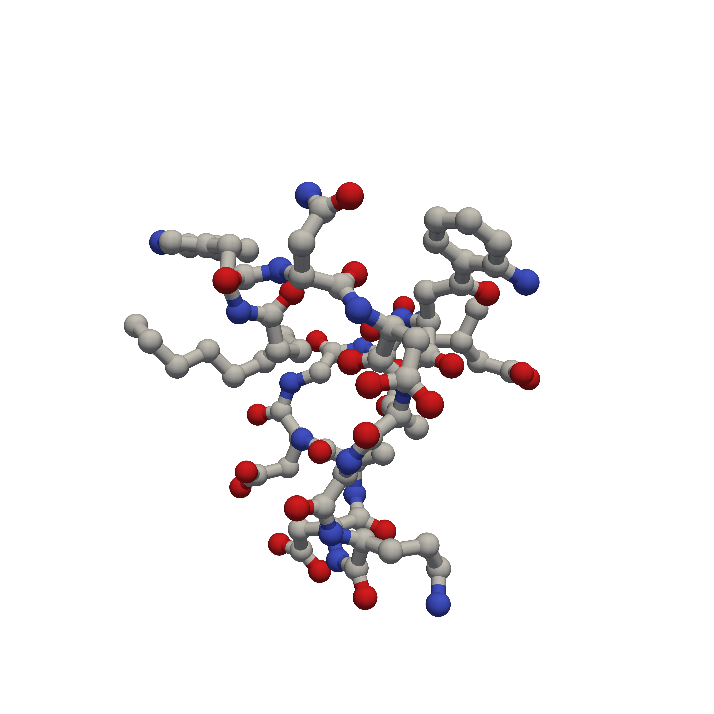
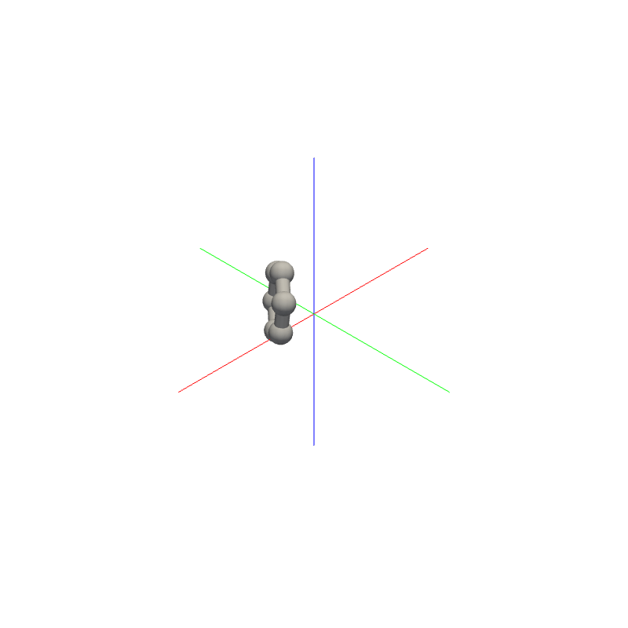

[](./LICENSE)

---

### Description
Small console app for drawing 3D molecular conformers.

### Usage
Create a high-resolution image of a daptomycin conformer:
```bash
./draw_static.py -i ./data/daptomycin.sdf -o ./out -n daptomycin.png -tb -wh 5000 -ww 5000
```


Create a simple GIF of an aromatic ring: 
```bash
./draw_gif.py -i "c1ccccc1" -o ./out -f 60 -aa
```


